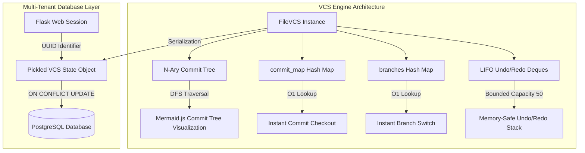

# Treebase 🌳 — Custom Version Control System & Sandbox

[](#)
[](#)
[](#)
[](#)
[](#)
[](#)

A visual Version Control System (VCS) and isolated in-browser Python execution sandbox engineered completely from scratch. Treebase demonstrates how classical data structures — N-ary trees, hash maps, double-ended queues (deques), and set-based search algorithms — power modern version control primitives (commits, checkouts, branching, and 3-way conflict-aware merging).

🔗 **[Launch the Live Web Application Demo Here](https://treebase.onrender.com)**

---

## 📖 Systems Architecture & Data Structures

Rather than treating version control as a file-system black box, Treebase explicitly implements Git-like operations using fundamental computer science data structures.



### 1. N-ary Tree (`CommitNode` DAG)
- **Commit Log Structure**: Every commit is a node in an N-ary tree. Each node stores a unique commit ID (short UUID hash), message, timestamp, code snapshot, parent pointer, and an array of pointers to child commits (`children[]`).
- **Branch Forks**: A branch point occurs naturally when a commit node has more than one child.
- **Merge Nodes**: Merged commits maintain parent links to both source branches, tracking the convergence of historical timelines.
- **DFS Visualization**: An O(N) Depth-First Search (DFS) traverses the commit graph starting at the root node, outputting Mermaid.js syntax to render the tree layout dynamically in the frontend.

### 2. O(1) Lookup Hash Maps
- **Commit Mapping (`commit_map`)**: A dictionary maps commit ID strings directly to `CommitNode` pointers. Checking out any commit in history is a direct lookup (`self.commit_map[commit_id]`), running in **O(1) time** rather than performing an O(N) DFS walk.
- **Branch Mapping (`branches`)**: A dictionary maps branch name strings to their corresponding HEAD `CommitNode` pointer. Switching branches is completed instantly in **O(1) time**.

### 3. Bounded Deques (Undo/Redo Stack)
- **LIFO Operations**: Double-ended queues (`collections.deque(maxlen=50)`) store code snapshots for editor undo/redo functions.
- **Eviction Guarantee**: Because the stack limit is strictly bounded at 50, appending to a full deque automatically discards the oldest editor state in O(1) time. This ensures memory remains bounded and prevents memory leaks, keeping user session blobs clean for database serialization.

### 4. Lowest Common Ancestor (LCA)
- **Shared Reference Search**: Prior to merging two branches, the engine identifies their Lowest Common Ancestor (LCA) by walking up from the current HEAD node, collecting ancestor IDs into a hash set, and tracing the target branch HEAD until a match is found. This runs in **O(D)** time (where D is the depth of the shallower branch).
- **3-Way Merging**: Compares three states: the LCA (Base), the current branch (Mine), and the target branch (Theirs). Uses the standard `diff3` line-by-line algorithm to auto-accept non-conflicting edits and wrap conflicting edits in conflict markers (`<<<<<<<`, `=======`, `>>>>>>>`).

---

## ✨ Features

- **Multi-Tenant Session Sandbox**: Fully anonymous multi-tenant environment. When you visit the app, Flask generates a unique UUID session, serializing your entire VCS state via `pickle` into a row in PostgreSQL. No logins are required, and session scopes are completely isolated.
- **Live Interactive Tree**: A sidebar rendering a live visual Mermaid.js tree. Checkouts, commits, branches, and merges are updated reactively.
- **Python Execution Sandbox**: Write Python scripts inside the editor and run them securely in a sandboxed subprocess with execution timeouts (10-second limit) and output capture.
- **Timeline Rollback**: Open the File History view to inspect past commit snapshots and check them out with a single click.

---

## 🛠️ Tech Stack

- **Backend**: Python 3.9+, Flask (Web API framework), Psycopg2 (Postgres database connector)
- **Database**: PostgreSQL (production session storage), SQLite (local development fallback)
- **Frontend**: HTML5, CSS3, ES6 JavaScript, Mermaid.js (commit tree rendering), Tailwind CSS (layout)
- **Deployment**: Docker, Gunicorn (WSGI HTTP Server), Render Blueprint

---

## 📂 Project Structure

```text
📦 Treebase
 ┣ 📂 backend                 # Python core logic and REST API server
 ┃ ┣ 📜 __init__.py           # Package initializer
 ┃ ┣ 📜 app.py                # Flask server, API endpoints, sandbox execution, and routing
 ┃ ┗ 📜 vcs_engine.py         # Core VCS algorithms (N-ary Tree, Hash Maps, Deques, LCA, diff3)
 ┣ 📂 frontend                # Responsive user interface layout
 ┃ ┣ 📂 static                # Client static assets
 ┃ ┃ ┣ 📂 css                 # Stylesheets
 ┃ ┃ ┣ 📂 img                 # Images and application logos
 ┃ ┃ ┗ 📂 js                  # Frontend logic (editor, API fetches, VCS client updates)
 ┃ ┗ 📂 templates             # HTML views served by Flask
 ┃ ┃ ┗ 📜 index.html          # Main application interface
 ┣ 📂 docs                    # Systems engineering and documentation assets
 ┃ ┣ 📜 index.html            # Visual VCS documentation page (academic thesis & specs)
 ┃ ┣ 📜 deep-dive.html        # Detailed walkthroughs of all five core algorithms
 ┃ ┗ 📜 benchmark.py          # Benchmark test script: Treebase memory vs File System read
 ┣ 📜 Dockerfile              # Containerized multi-tenant build profile (Python + Gunicorn)
 ┣ 📜 render.yaml             # Render Blueprint specification for PostgreSQL + Web Service
 ┣ 📜 requirements.txt        # Backend dependencies manifest
 ┣ 📜 wsgi.py                 # Web Server Gateway Interface entry point
 ┗ 📜 .gitignore              # Ignore definitions for Python, SQLite databases, and IDE logs
```

---

## 🚀 Local Development Setup

To run the application locally without requiring a PostgreSQL installation (it will automatically fallback to a local SQLite database):

1. **Clone the Repository**:
   ```bash
   git clone https://github.com/raghuramch028/Treebase.git
   cd Treebase
   ```

2. **Set up a Virtual Environment**:
   ```bash
   python -m venv .venv
   # Windows:
   .venv\Scripts\activate
   # Linux/macOS:
   source .venv/bin/activate
   ```

3. **Install Dependencies**:
   ```bash
   pip install -r requirements.txt
   ```

4. **Launch the Flask Server**:
   ```bash
   python wsgi.py
   ```
   *(Note: On initial boot, the engine creates a local `.treebase_store.db` file to handle session state offline).*

5. **Access the App**:
   Open your browser and navigate to **[http://localhost:5000](http://localhost:5000)**.

---

## 🐳 Docker Deployment

The project is pre-configured to build and run inside a containerized Docker environment:

1. **Build the Docker Image**:
   ```bash
   docker build -t treebase-vcs .
   ```

2. **Run the Sandbox Container**:
   To run locally in SQLite mode:
   ```bash
   docker run -d -p 5000:5000 --name treebase-container treebase-vcs
   ```
   To run in production mode with a remote PostgreSQL instance:
   ```bash
   docker run -d -p 5000:5000 -e DATABASE_URL="your-postgresql-connection-string" --name treebase-container treebase-vcs
   ```

3. Open **[http://localhost:5000](http://localhost:5000)** in your browser.

---

## ⚙️ Recommended GitHub Repository Metadata

To optimize the repository landing page for technical reviews on GitHub, configure the settings with the following details:

- **Description**: `A custom Git-like Version Control System & Python sandbox built from scratch using N-ary Trees, Hash Maps, Bounded Deques, and diff3 merging.`
- **Website URL**: `https://treebase.onrender.com`
- **Topics**: `python`, `flask`, `postgresql`, `version-control`, `git-clone`, `docker`, `javascript`, `sqlite`
